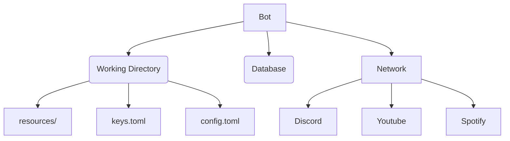

# UTF-Nate

A discord bot made in rust. Play music, set an intro clip for yourself, and extend with custom
commands!

## Features

### Joining voice

First get the bot into a channel using `summon`, and it will join whatever channel you are in.

Get rid of it again with `banish`

### Herald

Announce your arrival or departure from a channel automatically with a short clip, for any channel
the bot is in!

* `intro` and `outro` let you select from a selection of clips (try `list` to find what comes with
  the bot), or give it any mp3 or wav link on the internet!
* You can change how the bot introduces *itself*, with the `botintro` command.
* The commands fuzzy search the built in clips. Try finding what you like by putting in text
  close to what you want!

### Play music and clips

You can play both the in built clips, and YouTube content. Because both can be searched, there
are two separate commands for them.

* `play` lets you pass in a YouTube link, Spotify link, link to an audio file, or any text that it
will then get the first result from YouTube an play it!
* Both Spotify and YouTube playlists are supported! Get a link and it will queue everything at once.
* `clip` searches the built in clips for the best matching name, and plays that.

There's a lot more you can do when playing YouTube links, and modifying the queue of audio coming
up.

* `playnext` and `playnow` allow you to skip the line, and change where your addition will start
  in the queue.
* `queue` lets you see what's coming up.
* `skip` can be used to skip what's playing now, or can be passed a number or range of numbers to
  change the queue (use `queue` to identify the numbers)
* `shuffle` can be used to mix up the entire queue.
* `pause` the queue, or `stop` it entirely

And even more! Take a look at `help` for the full list of commands

### Customization

Whoever sets up your bot can set up some scripts on their server, which you can run using `cmd`.
It will vary quite a bit, but setting something up to start and stop a dedicated video game
server is a great example of something that is useful for anyone in your server to want to do!

## Building

Although it is primarily rust, a few dependencies have system library dependencies. If `cargo build`
is insufficient, it is likely that a system library is missing. For that reason there is a setup
script to download required packages for building on Debian, and there is a nix package
definition which will handle all dependencies for you.

### Cargo

Build into the `target/` folder
```sh
cargo build
```

### Nix

Nix supports many options for how to build/install. The package manager can run on any Linux
distribution (probably). These instructions will cover building it yourself, but also take a look at
things like `nix install` and `nix bundle`.

Build the binary into the `result/` folder
```sh
nix build
```

You can also cross compile (but it's slow the first time as there is no binary cross compiler
cache). If you go down this route I recommend using `keep-outputs = true` in your nix.conf. Retain a
copy of the output in `result` or something like `result.for-aarch64-unknown-linux-gnu` for example, to
keep a gc root around (both are in the .gitignore).

E.g.
```sh
nix build .#utf-nate-for-aarch64-linux -o result.for-aarch64-linux
```


If you have binfmt emulation, you can also natively compile it with emulation.

E.g.
```sh
nix build .#packages.aarch64-linux.utf-nate
```

`nix bundle` also provides ways to distribute it outside of the nix package manager.

If you're looking for a specific way to distribute it, such as to another computer that doesn't have
the nix package manager, take a look at `nix bundle`.

### Docker

Create a nix docker image containing the executable (resources not included).
```sh
nix bundle --bundler .#docker .
```

Or you can create a cross compiled docker image.
```sh
nix bundle --bundler .#docker-for-aarch64-linux .#utf-nate-for-aarch64-linux
```

### Debian

```sh
# install the required external dependencies
sudo setup/debian-build-setup.sh
# install cargo-deb to create a deb package, for most convenience
cargo install cargo-deb
```

Now each subsequent build is very simple.
```sh
# build a deb package (into `target/debian`)
cargo deb
# or build the executable itself (into `target/release`)
cargo build --release
# or install directly, location depends on user and can be changed if desired: https://doc.rust-lang.org/cargo/commands/cargo-install.html
cargo install --path .
```

If you want to build with specific features only, you can disable default features, and add
features, or any mix thereof.
```sh
# minimal features with --no-default-features (see cargo for details)
cargo deb -- --no-default-features --features tls-rustls
# or
cargo build --release --no-default-features --features tls-rustls
# or
cargo install --path . --no-default-features --features tls-rustls

# add features with --features (see cargo for details)
cargo deb -- --features http-interface
# or
cargo build --release --features http-interface
# or
cargo install --path . --features http-interface

# --features and --no-default-features can be mixed
```

The deb package is not required but additionally specifies dependencies when installing.

No matter what build, the resources folder must be delivered separately.

## Setup

There are several components that the bot communicates with. Here is a diagram.



Your setup will need to have those resources available, or some commands may not work.

### Debian

Currently, because maximum stability is gained from using the latest yt-dlp, it is installed with
the latest version, not from Debian packages. If you want to go this route, use the
`setup/debian-run-setup.sh` script. It will also install python for yt-dlp.
```sh
sudo setup/debian-run-setup.sh
```

All paths are managed by the working directory. Run the bot from a directory with the
`resources/` folder in it, as well as a `keys.toml` and `config.toml` file (expanded upon below).

### Database

You will need a database, either postgresql or sqlite will work. For sqlite, there are examples
in `keys.template.toml` where you can easily just make a file database. For postgresql, you'll
have to set one up.

If the database needs to be set up, you can use the following command to create all necessary
tables without actually running the bot.
```sh
utf-nate --init-database --no-bot
```

### File setup

Once you have the executable or deb package installed, the usage requires just one more important
note. It uses the working directory to find the `resources/` folder, `keys.toml` file, and
`config.toml` file.

Copy the `resources/` folder directly, this is already set up. You can add more commands integrated
into your bot by adding to `resources/cmd/`, or more sounds by adding to `resources/clips/`.

For `keys.toml` and `config.toml`, take a look at the corresponding templates (`keys.template.toml`
and `config.template.toml`). They come with examples and descriptions of each field required.

### Concurrent bots

It is very easy to share the `resources/` folder between bots with a symlink, and have separate
`keys.toml` and `config.toml`. All you need to do is set up separate working directories they
launch in. This is why they are not installed using any `etc/` files or anything. The setup requires
slightly more care than just a deb package, but you can have multiple instances playing different
queues sharing the same database for user settings!

## Running

Now that you've got your folder and config files setup, all you have to do, from that same
directory, is run it. If it's on your path, no arguments are required.

```sh
utf-nate
```

For information on arguments available, use
```sh
utf-nate --help
```

### Nix

You can also run without "installing" (to your system path) using nix.

```sh
nix run
```

### Docker

If you use the Dockerfile, the default working directory is /opt/utf-nate. Put the resources,
keys.toml, and config.toml there.

I recommend building the docker image using nix. Then do all your docker magic to pass along access
to the resources folder, keys.toml, config.toml, network to the database, etc. I don't use docker
much, hopefully if you're reading this you really just need the image.
